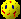
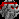

 \

Blob Wars : Episode I

# License and Disclaimer

This program is free software; you can redistribute it and/or modify
it under the terms of the GNU General Public License as published by
the Free Software Foundation; either version 2 of the License, or
(at your option) any later version.

This program is distributed in the hope that it will be useful,
but WITHOUT ANY WARRANTY; without even the implied warranty of
MERCHANTABILITY or FITNESS FOR A PARTICULAR PURPOSE.  See the
GNU General Public License for more details.

You should have received a copy of the GNU General Public License along
with this program; if not, write to the Free Software Foundation, Inc.,
51 Franklin Street, Fifth Floor, Boston, MA 02110-1301 USA.

You can read the full license by clicking [here](license).

This license agreement is shown the first time the game is played. IT
MUST NOT BE REMOVED UNDER ANY CIRCUMSTANCES. DO NOT DISTRIBUTE THIS GAME
IN ANY FORM WHERE THE USER DOES NOT SEE THE LICENSE.

Be aware that depending on the version of the game you are playing this manual
may be incomplete or incorrect in places.

# Introduction

Blob Wars : Metal Blob Solid is a platform game, not unlike those found on the
Amiga and SNES. The object of the game is to take on the role of a soldier
Blob named Bob, and play through the various levels and attempt to rescue as
many MIA (Missing In Action) Blobs as possible. This is not quite as
straightforward as it sounds, since the MIAs will often be not directly
reachable and will require some extra thought. Bob also has to contend with
environmental hazards, alien invaders and assimilated Blobs.

# Requirements

Blob Wars requires the following libraries:

- [fmt](https://fmt.dev/)
- [SDL2](https://www.libsdl.org/)
- [SDL2 Image](https://www.libsdl.org/projects/SDL_image/)
- [SDL2 Mixer](https://www.libsdl.org/projects/SDL_mixer/)
- [SDL2 Net](https://www.libsdl.org/projects/SDL_net/)
- [SDL2 TTF](https://www.libsdl.org/projects/SDL_ttf/)
- [yaml-cpp](https://github.com/jbeder/yaml-cpp/)
- [Zlib](https://www.zlib.net/)

Furthermore, it requires the following machine specifications:

- Screen Resolution: 640 x 480
- CPU: 1 GHz
- RAM: 100 MB
- Disk space: 80 MB
- Controls: Keyboard or Joypad

To build Blob Wars, the header files of the above libraries must be installed, as well as the following tools:

- [Meson](https://mesonbuild.com/)

# Installation

Blob Wars : Metal Blob Solid can be installed in two different ways. The first
(and easiest) is by using your distribution's package manager to install a
pre-compiled version of Blob Wars. Most well-known distributions have this game
packaged under the name "blobwars".

## Build from source

If your distribution does not come with a package for Blob Wars, or if it
doesn't come with the latest version, you can choose to build the game from
source. This will require all the appropriate development libraries (see
Requirements) and some knowledge of building an application using the source
code. Open a terminal and use the following commands to extract the source code
from a `.tar.gz` file (remember to change the filename to match the name of
the download):

    tar xzf blobwars-x.x-x.tar.gz
    cd blobwars-x.x-x

Alternatively, if you have git installed, you can get the latest source code
from GitHub:

    git clone https://github.com/perpendicular-dimensions/blobwars.git
    cd blobwars

To build the binaries, run the following commands:

    meson --buildtype release build
    ninja -C build

To test if the binary works, run:

    build/src/blobwars -data .

To install the game run:

    ninja -C build install

The last command might ask for your password in order to gain the necessary
privileges to perform the installation.

Notes:

- Default installation target is `/usr/local/games/` for the binary and
  `/usr/local/share/games/` for the data.
- Music and font data are extracted to `/tmp/` and loaded from there. SDL
  currently does not support loading music and fonts directly from memory.
- Menu items are added for Gnome and KDE desktops into Games and Games/Arcade
  respectively.

## Medal Service

This step is optional. If you wish to make use of the Medal Service (in-game
achievements), you will need to create and install a Medal Key. This is a
simple process, which should not take more than a few minutes. To create the
Medal Key, visit:

<http://www.stephenjsweeney.com/games/medals>

There you will find information on how to setup the service.

# Running

Either type,

    blobwars

in a terminal window, or you can use the menu links that have been added for
Gnome and KDE desktops. These under located in Games and Games/Arcade
respectively.

# The Story

Bob is a soldier in the Blob Army. Many years ago the Blobs' homeworld was
invaded by a race of symbiotic cybernetic organisms. Since then the Blobs have
faced a lifetime of war. Recently the Blob Army has decided to fall back,
regroup and change their offensive strategy. But some soldiers did not regroup.
They were marked as Missing In Action and left behind. However, one soldier was
not happy with this arrangement.

Bob made it his mission to go out and *"Bring Our Boys Home"*. There had been
enough loss of life already, and Bob wanted to bring back as many soldiers as
possible, even if he died trying.

But one thing puzzled him. The aliens could have wiped out their planet in just
a matter of months. But they hadn't. The aliens could have taken all the
resources they wanted and left. But they hadn't. What were they really after?
And why?

# Controls

## Title / Options

| Key                      | Action                |
| ------------------------ | --------------------- |
| Arrow Up / Arrow Down    | Change menu selection |
| Arrow Left / Arrow Right | Change menu option    |
| Enter / Space / LCtrl    | Accept                |
| Escape                   | Back                  |

## Hub

| Key                | Action                                  |
| ------------------ | --------------------------------------- |
| Arrow keys / Mouse | Move Cursor                             |
| Left Mouse Button  | Select Icon Option / Select Destination |
| Right Mouse Button | Destination Information                 |

## In Game (whilst on the ground)

| Key                | Action                          |
| ------------------ | ------------------------------- |
| Arrow Left / Right | Move Left / Right               |
| Arrow Up           | Jump                            |
| LCtrl              | Fire                            |
| Space              | Activate Jetpack (once acquired) |

## In Game (whilst swimming)

| Key                | Action            |
| ------------------ | ----------------- |
| Arrow Up / Down    | Swim Up / Down    |
| Arrow Left / Right | Swim Left / Right |
| LCtrl              | Fire              |

## In Game (General)

| Key    | Action       |
| ------ | ------------ |
| Tab    | Radar Map    |
| P      | Pause Game   |
| Escape | In Game Menu |

## Misc

| Key          | Action             |
| ------------ | ------------------ |
| F10          | Toggle Full Screen |
| Alt + Return | Toggle Full Screen |

# Starting a New Game

From the Title screen select "Start New Game", then choose your difficulty
level. Depending on the difficulty you choose the game will play in a different
manner. Below is a description of how the difficulty level affects the game play:

## Practice

- Optionally complete various tasks
- Unlimited continues

*This is just a training level. It does not count toward the game.*

## Easy

- Rescue MIAs
- No further objectives (no Boss missions either)
- Few Enemies
- Enemies spawn slowly and in few numbers
- Enemies attack rarely

## Normal

- Rescue MIAs
- Complete additional required objectives
- Normal number of enemies
- Enemies spawn normally and in normal numbers
- Enemies attack normally

## Hard

- Rescue MIAs
- Complete additional required objectives
- Large numbers of enemies
- Enemies spawn rapidly and in great numbers
- Enemies attack constantly

## Extreme

- Rescue ALL MIAs
- Complete ALL Objectives
- Large numbers of enemies
- Enemies spawn rapidly and in greater numbers
- Enemies attack constantly
- You must complete the mission within a set time

*This setting cannot be attempted until you have complete the game once.*

# Keyboard Configuration

To change the controls select Keyboard Configuration from the Options screen.

The currently configured button will be displayed to the right of the action.
To configure an action highlight the action you wish to set (using the arrow
keys on the keyboard) and then press Return. The current button configuration
entry will disappear and allow you to press the new key you wish to use. After
doing so the new button will then be displayed.

Repeat this process until you have configured all the keys you wish to. Key
configuration is saved to a file called `keyboard.conf` in
`~/.parallelrealities/blobwars/`. Configuration is saved only once and not on a
save game basis.

If you wish to test out your configuration and tweak the settings to your
liking it is recommended that you start a game in Practice mode where you can
easily tweak and buttons and test the output.

# Joypad Configuration

Should you have a game controller such as a joystick or joypad connected, then
you will be able to configure the controls in this screen. The controls that
can be configured map to the actions that can be performed in the game, for
example: Up, Down, Left, Right, Fire.

The currently configured button will be displayed to the right of the action.
To configure a joypad action, highlight the action you wish to set (using the
arrow keys on the keyboard) and then press Return. The current button
configuration entry will disappear and allow you to press the new button on
your joystick. After doing so the new button will then be displayed.

Repeat this process until you have configured all the buttons you wish to.
Joypad configuration is saved to a file called `joystick.conf` in
`~/.parallelrealities/blobwars/`. Configuration is saved only once and not on a
save game basis.

If you wish to test out your configuration and tweak the settings to your
liking it is recommended that you start a game in Practice mode where you can
easily tweak and buttons and test the output.

# Options

Various options are available to the player. These options can be set from the
Title screen, the Hub or from In Game. Highlight an option by pressing the Up
or Down arrow keys and then the Left or Right arrow keys in order to change the
option's value.

- **Fullscreen**:
  Toggles fullscreen mode. Either Off or On.
- **Sound Volume**:
  Changes sound volume.
  Slide the bar left or right to decrease or increase the sound volume.
- **Music Volume**:
  Changes music volume.
  Slide the bar left or right to decrease or increase the music volume.
- **Output Type**:
  Change the game's audio output type. You may select None, Mono or Stereo.
  The game will have to be restarted in order for a change from Mono to Stereo to take effect.
- **Auto Save Slot**:
  Selects the save slot the game will auto save the game to.
  Choose from slots 1, 2, 3, 4 or 5.
- **Brightness**:
  Changes the brightness.
  Slide the bar left or right to decrease or increase the brightness of the display.
- **Blood and Gore**:
  Toggles the blood during gameplay. Either Off or On.
- **Configure Keyboard**:
  Go to the key configuration menu.
- **Configure Joysticks**:
  Go to the joystick configuration menu *(disabled if no joysticks are detected)*.

# How to Play

Playing Blob Wars : Metal Blob Solid is very straight forward. If you have ever
played games such as Super Mario Brothers then you will get the hang of the
game very quickly. Blob Wars : Metal Blob Solid has game play elements more
closely related to The New Zealand Story though, since you have weapons with
which to attack and can do other things such as swim.

You can move Bob around the game world by using the arrow keys (see Controls)
and using left CTRL to fire your current weapon. Due to the nature of the game,
there are no ammunition restrictions so you can use your current weapon as much
as you want. Also note that it is not possible to manually change weapons. To
change your weapon you must pick up a weapon icon.

Remember to keep an eye on your health (the red squares at the top of the
screen). When you take damage you will lose a red square (or more depending on
how you were damaged!). Bob is killed when all his health is depleted. At this
point the game ends and you fail the mission. If you have reached a checkpoint
before this time you will be given the option to continue (see Checkpoints).
You get health back by picking up Cherries (a Blob's staple diet). One Cherry
restores on unit of health so grab them whenever you see them.

When swimming you have a limited amount of oxygen. Your current oxygen is
represented by a set of blue squares to the right of your health. When you are
underwater these squares are slowly removed. Once they run out your health will
quickly begin to deplete, so don't stay underwater too long! You get oxygen
back when you are out of the water.

Blob Wars : Metal Blob Solid is divded into various missions, each with their
own objectives. Depending on the level of difficulty you play on the number of
objectives will change. For all difficulty levels you will be required to
rescue a certain amount of MIAs. Other difficulty levels will have other
objectives that you will be required to complete. See "Completing Missions" for
more information.

# Rescuing MIAs

{.float}
To rescue an MIA you simply walk into them. They will then be automatically
teleported back home. This however is not always easy.  Since you can only
rescue an MIA by walking into them, you must first *be able* to do so. Some
MIAs will be in high places, others behind doors. You may have to over come
certain obstacles and other factors before you can rescue them.

# Objectives

As well as rescuing MIAs, some missions have other objectives. These can vary
from finding objects, to defeating a certain enemies or number of enemies.
Before a mission can be cleared you must first complete all the required
objectives. Special objectives, such as Exiting a Mission, can only be achieved
once all the other required objectives are completed. If that sounds
complicated, don't worry, you'll get the idea! See "Completing Missions" for
more information.

You can see a list of objectives by pressing "P" to pause the game. This will
also show each objective's completion status, including how much more is needed
to be done.

# Completing Missions

In order to complete a mission in Blob Wars : Metal Blob Solid, you will need
to complete all the required objectives. For most missions this will involve
rescuing a certain number of MIAs. The required objectives change depending on
which level of difficulty you are playing on.

The mission "Grasslands" requires you to rescue 5 MIAs. If you have set the
difficulty to Normal or above then you will also be required to find a
Transmitter.

During the course of the mission you will receive checkpoints. These
checkpoints allow you continue if you are killed during the mission. See below
for more information.

# Checkpoints

Upon completing objectives you will be awarded a checkpoint. A checkpoint allows
you to restart the mission from a certain point if you are killed during play.
When you are presented with the Game Over text, pressing space will bring up
the continue options. You may either restart from the last checkpoint or return
to the title screen. If you did not reach a checkpoint when you are killed you
will simply be taken back to the title screen without prompting.

Checkpoints are also awarded for rescuing half the number of required MIAs, all
the required MIAs and the total MIAs on a mission. So, if you are required to
rescue 12 MIAs you will receive a checkpoint after rescuing 6 and another for
rescuing all 12.

When restarting you will restart from the location you were at when the
checkpoint was awarded (or the last place where you were on solid ground). You
will restart with half your full health and everything you did before you were
killed will be the way it was (so, if you saved an MIA after a checkpoint and
were killed before receiving another you won't have to rescue the MIA again).
Checkpoints can only be used a maximum of 3 times. Every time you receive a
checkpoint notice you will be allowed to continue a further 3 times. The number
of continues remaining is noted in brackets next to the Continue option.

Note that due to the nature of the game it is not possible to continue on Boss
missions.

# Game Over

The game ends when Bob is killed during a mission (his health is reduced to 0).
At this point you will be presented with a Game Over message. If you have
managed to receive a check point (from completing objectives) you will be given
the option to return to this check point or quit to the title screen. Otherwise
you will be taken back to the title screen.

# The Hub

The Hub is the place you will spend time between missions. The Hub allows you
to select which mission you will next undertake and also give you information
relating to the missions you have just done, which MIAs you have currently
rescued and some overall game statistics.

The Hub can be effectively divided into three different areas - The Map, the
Destination Bar and the Action Bar

The main screen of the Hub is the map. The map will show various locations that
can be visited (represented by animated red shapes). Placing the mouse cursor
over these locations will show their name just above the cursor. To select a
destination left click on the location. The Destination Bar will change to
reflect the name destination you have chosen. Right clicking on the location
will display statistics about the location (more on that in a minute!).

The Action Bar has 6 options - Start, Info, MIAs, Stats, Options and Quit.

Clicking on Start will allow you play the mission you have currently selected
(as Selected Destination).

Info will display information about the destination you have selected. You
will be shown how many MIAs you have rescued in that area and which objectives
you have currently completed. This will be useful to you later in the game when
you wish to revisit missions in order to complete them fully. A briefing is
available for missions that have yet to be cleared and an objective summary is
available afterwards.

MIAs displays a list of all the MIAs that you have and haven't currently
rescued. The list is updated once an area is cleared. The list shows the MIAs
names, locations and their status (Found or Missing). Like the Info screen this
is useful for discovering what levels need to still be rescued. Click in the
Left and Right arrows to scroll through the various pages.

Stats gives you some information on how you are currently doing in the game.
Most of the information here is just for fun. There are three pages, giving
various bits of information. One thing to note - You may notice that the
Percentage Complete statistic fluctuates a lot. This is because this is a
percentage of what is currently known and not an overall percentage. So you may
notice that at one stage it says 60% and then after finishing a stage it says
55%!

# Enemies

The aliens are now littered around the Blobs' homeworld. Most of them have
taken over the bodies of Blob soldiers and are using them for their evil
purposes. Some others travel around in their robot housing. Most of the enemies
are easily dealt with - A single shot will take them down. But what they lack
in defence they make up for in weaponry. Here are just a couple of the enemies
you may encounter,

## Pistol Blob

{.float}
Once a cadet in the Blob army this Blob has been assimilated by the alien's
nano technology. Weak and poor shots, these Blobs can still cause Bob problems
in large numbers. Their green colouring is the result of alien's assimilation
process.

## Eye Droid

{.float}
A floating alien sentry. Given the ability to fly by its Anti Grav unit, it will
attack Bob on sight. Easily downed... but keep a safe distance, these suckers
explode!

Other Blobs, arial and swimming enemies exist. Keep your eyes peeled...

# Bosses

During the course of them game (except Easy) you will encounter Bosses. These
are often Blobs that the aliens have experimented on and transformed into
hidious creatures. They are a lot stronger than normal enemies, attack
differently and are all very dangerous. Bob will have to confront each other
these bosses before he can move on. In some cases the boss's base area will
also contain a item that essential to Bob's progress within the game.

# Galdov

{.float}
Galdov is the alien leader. He looks strangely like the Blobs, except for the
fact that he is entirely robotic. He has been dubbed Metal Blob by the Blobs
for his appearance seems to harbour a secret to the Blobs' past, the reason the
aliens have attack their world and the myths and legends of "war".

A particular times in the game you will be required to battle Galdov. He is
more powerful than regular enemies and has more weapons available at his
disposal. Don't linger.

# Weapons

There are five different weapons that Bob can get in Blob Wars : Metal Blob
Solid:

| Weapon       | Symbol                                        | Description  |
| ------------ | --------------------------------------------- | ------------ |
| Pistol       |           | This is your standard weapon and the weapon that Bob always begins a mission with. Compared to the other weapons it seems rather wimpy due to its slow during rate. However it is the *only* weapon that can be fired underwater! |
| Machine Gun  |  | Somewhat the same as the pistol except for the high firing rate. This is a useful mission for clearing large numbers of enemies quickly. |
| Grenades     |         | Grenades bounce around and explode on contact. The explosion is enough to take out a few enemies within a small radius. Although grenades cannot be thrown underwater, it is possible to jump out of the water and throw a grenade. Careful timing can help to take out enemies in the water. The explosion from your own grenades cannot harm you, so don't worry. Grenades also have other uses, since they can be thrown into places Bob may not be able to normally access... |
| Laser Cannon |      | Slow to fire but has the devastating effect of passing through the enemy it strikes. A single laser bolt can take out a great deal of enemies. It also bounces if it hits something solid, which means that it can strike enemies both in front and behind you! |
| Spread       |           | A three way spread weapon. It is good for taking out enemies above and below. Has a decent firing rate too! |

# Items

Besides the weapon pick ups there are also a couple of others you should
be aware
of,

| Item     | Symbol                       | Description |
| -------- | ---------------------------- | ----------- |
| Cherry   |    | A cherry will restore one unit of valuable health to you. Make sure you pick them up as soon as you see them. Cherries can also be found in pairs or in a large bunch, restoring 2 and 5 units of health respectively. |
| Keycards |  | Keycards and keys are used to access doors and other places in the game. Search the levels carefully to find them. |
| Points   |  | These are points pods. They increase your score and come in various different flavours. |

# Aqua Lung and Jetpack

Two special unique items appear in the game - An Aqua Lung and a Jetpack. These
two items are both essential for progressing further in missions and also for
rescuing all the MIAs. Some missions will *require* you to have one of these
two items so you can play them properly.

{.float}
The Aqua Lung provides the player with an unlimited supply of oxygen, so you
can stay underwater forever. You will then be able to reach MIAs and areas that
you were previously unable to. There is no need to activate this item, it is
used automatically when you enter water. You will also notice that there is no
longer an oxygen meter at the top of the screen. Note that the Aqua Lung *does
not* protect you from slime and lava.

{.float}
The Jetpack allows the player to fly for a short time when it is activated.
Press Space and then use the directional buttons to fly in the direction you
desire. There are two things to note about the Jetpack - Unlike enemies, when
flying Bob will suffer inertia... that is to say, if you are flying left and
then push right you will have to slow down before you can begin flying right.
You can however fly one way and shoot another using this technique. The second
thing to note is that the Jetpack has an energy limit. Whilst it is activated
it will lose power. The remaining power is shown at the top of the screen (in
place of oxygen). When the power runs out, the Jetpack will automatically
disengage. The Jetpack recharges whilst it is not in use. Note that the Jetpack
cannot be reactivated if it has less than 3 units of power.

These items will become available as your progress through the game. They are
unique so only need to be found once (so don't panic if you haven't found them,
you can't miss them!).

# Misc Gameplay Information

As you progress through the game you may notice that some levels have
objectives marked as "???????????". These objectives (at the time) are optional
but all will be revealed much later into the game's story.

There is no need to worry about completing these objectives until you are
prompted to by the game.

# About Parallel Realities

Parallel Realities started off writing games on the Amiga using AMOS and then,
later, Blitz Basic 2. Games written included the BOTSS Trilogy and most notably
TANX Squadron. TANX Squadron was awarded Amiga Format's contributor prize of
the month in the summer of 1999. Project : Starfighter was Parallel Realities'
first contribution to the Linux gaming scene and was well received when it was
released in 2003.

Blob Wars : Metal Blob Solid is our second contribution to Linux and we hope
you enjoy it as much as Project : Starfighter. Like Starfighter the game went
through several incarnation before the platform game was decided on. The
original game involved a Capture the Flag type affair whilst the second was
centered on a Blob agent called Solid Blob and his (rather dopey) companion,
Bob.

The game direction changed when we wanted something a little faster paced and
with more replay value. The game changed from its top down view point to a
platform game and the Evil Blobs became assimilated Blobs. Bob later became the
hero of the game now known as Metal Blob Solid.

# About Perpendicular Dimensions

After 2011, Parallel Realities stopped maintaining Blob Wars. It is now
maintiained by others under the name Perpendicular Dimensions. We like to thank
Parallel Realities for creating this great game and for releasing it under a
FOSS license.

---

Blob Wars : Metal Blob Solid  
Copyright © 2004-2011 Parallel Realities  
Copyright © 2011-2015 Perpendicular Dimensions  
Licensed under the GNU General Public License.

[www.parallelrealities.co.uk](http://www.parallelrealities.co.uk)
